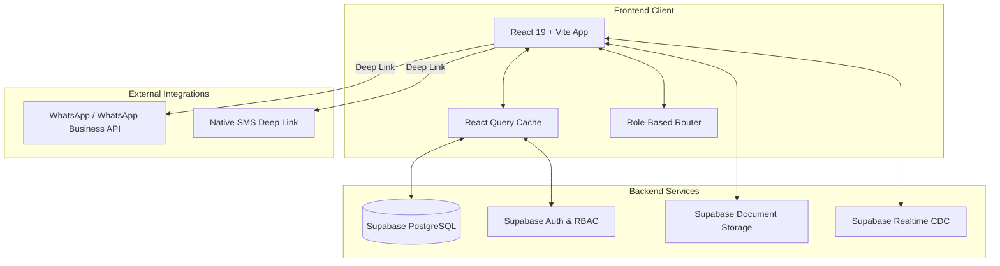

# ⚡ TeleManager - Enterprise Lead & Telemarketing Hub


**TeleManager** is a full-stack, enterprise-grade telemarketing CRM and lead management platform custom-built for high-volume sales teams (e.g. Coshare Loan Consultancy). It streamlines the end-to-end lead lifecycle—from raw Excel ingestion and automated Malaysian IC age-filtering to role-based distribution, real-time team analytics, and one-click WhatsApp/SMS customer outreach.

---

## 🎯 Business Impact (UniPact Bounty #UP-001)

Developed to address critical SME operational bottlenecks for a sales force of 100+ agents:
- ⏱️ **Time Efficiency**: Saves an estimated **14 hours per agent weekly** by automating lead formatting, deduplication, and manual data copy-pasting.
- 💰 **Cost Savings**: Replaces expensive SaaS CRM licenses, saving **~RM 2,500 annually**.
- 🔒 **Data Integrity & Sync**: Eliminates cross-device session collisions and stale data states when agents transition between desktop and mobile devices for customer outreach.

---

## ✨ Core Feature Suite

### 🔐 Multi-Tier Role-Based Access Control (RBAC)
Dedicated views, granular data permissions, and tailored routing for 4 operational tiers:
- 👑 **Super Admin (`super_admin`)**: Global system configuration, user provisioning, role assignments, feedback resolution, and database utility access.
- 🏢 **General Manager (`general_manager`)**: High-level macro analytics, cross-team performance metrics, and organization-wide pipeline health monitoring.
- 📊 **Manager (`manager`)**: Team lead workspace, lead pool allocation, agent lead distribution, backlog management, and performance tracking.
- 🎧 **Staff / Agent (`agent`)**: Personal lead queue, contact status transitions, dynamic promotional script picker, document vault uploads, and 1-click communications.

### 🇲🇾 Smart Lead Extraction & Malaysian IC Engine
- **Multi-Format Spreadsheet Parsing**: Ingests `.xlsx`, `.xls`, and `.csv` lead files seamlessly using SheetJS (`xlsx`).
- **Malaysian IC & DOB Extractor**: Parses 12-digit IC strings (`YYMMDD-PB-###`) to extract birth years, enabling targeted lead filtering by custom age brackets (e.g. 25–55 years old).
- **Automated Phone Sanitization**: Cleans ambiguous formats into standardized Malaysian `601x` mobile numbers.
- **Database Deduplication**: Automatically detects and prevents duplicate phone entries across team lead pools.

### 💬 One-Click Outreach & Custom Script Engine
- **Dual WhatsApp Routing**: Supports native deep-linking to both **Personal WhatsApp** (`wa.me`) and **WhatsApp Business** (`api.whatsapp.com`).
- **One-Click SMS**: Direct OS integration for rapid SMS dispatch.
- **Dynamic Script Templates**: Built-in promotional script manager with automatic tag substitution (`{Name}`, `{IC}`, `{Phone}`).

### 📊 Real-Time Analytics & Team Metrics
- Interactive visual dashboards powered by **Recharts**:
  - Lead status breakdown (Pending, In Progress, Interested, Callback, Done, Unreachable).
  - Conversion rates, agent activity logs, and backlog volume distributions.
- **Live Supabase CDC**: Real-time Postgres channel synchronization paired with `@tanstack/react-query` cache invalidation.

### 📂 Customer Pipeline & Document Vault
- **Customer Document Management**: Securely attach customer payslips, IC copies, and financial documents via Supabase Storage.
- **Stuck Cases Monitor**: Proactive alert system flagging inactive leads requiring follow-up.

### 🔄 Over-The-Air (OTA) Version Stamping
- Automated version stamping script (`scripts/stamp-version.js`) integrated into the Vite build process.
- Live background version polling that alerts agents to refresh when a new build is deployed.

---

## 🏗️ System Architecture



---

## 📁 Project Structure

```
TeleManager/
├── frontend/                      # Main React 19 + Vite Frontend Workspace
│   ├── backlog/                   # Raw lead backlog & batch processing data
│   ├── public/                    # Static assets & icons
│   ├── scripts/                   # Version stamping & backlog utility scripts
│   ├── src/
│   │   ├── components/            # UI dashboards & components
│   │   │   ├── admin/             # Super Admin management panels
│   │   │   ├── pipeline/          # Customer pipeline & document views
│   │   │   ├── AdminDashboard.jsx # Super Admin master dashboard
│   │   │   ├── GMDashboard.jsx   # General Manager analytics dashboard
│   │   │   ├── ManagerDashboard.jsx # Manager lead allocation panel
│   │   │   ├── StaffDashboard.jsx   # Telemarketing Agent workspace
│   │   │   └── Login.jsx          # Secure multi-role authentication
│   │   ├── hooks/                 # Custom React hooks (Supabase query hooks)
│   │   ├── utils.js               # Phone normalization & IC parser heuristics
│   │   ├── supabase.js            # Supabase JS client configuration
│   │   └── App.jsx                # Application root & role router
│   ├── package.json               # Dependencies & build scripts
│   └── vite.config.js             # Vite build configuration
├── scripts/                       # Root level automation scripts
├── package.json                   # Root workspace manifest
└── README.md                      # Project documentation
```

---

## 🚀 Getting Started

### Prerequisites
- **Node.js**: v18.0.0 or higher
- **npm**: v9.0.0 or higher
- **Supabase Project**: Active Supabase instance with database tables configured

### Installation

1. Clone the repository:
   ```bash
   git clone https://github.com/DwZukii/Loan-Manager.git
   cd TeleManager/frontend
   ```

2. Install dependencies:
   ```bash
   npm install
   ```

3. Configure Environment Variables:
   Create a `.env` file in the `frontend/` directory:
   ```env
   VITE_SUPABASE_URL=https://your-supabase-project-id.supabase.co
   VITE_SUPABASE_ANON_KEY=your-supabase-anon-key
   ```

4. Run Development Server:
   ```bash
   npm run dev
   ```

5. Open your browser at `http://localhost:5173`.

---

## 🛠️ Tech Stack

- **Frontend**: React 19, Vite 6, JavaScript (ESNext)
- **Styling**: Tailwind CSS 4
- **State & Data Fetching**: `@tanstack/react-query` v5
- **Backend & Database**: Supabase (PostgreSQL, Row Level Security, Storage, Realtime CDC)
- **Data Visualization**: Recharts
- **Icons & UI**: Lucide React, Sonner (Toast notifications)
- **Spreadsheet Ingestion**: SheetJS (`xlsx`)
- **Deployment**: Vercel

---

## 📝 License

This project is licensed under the MIT License.
