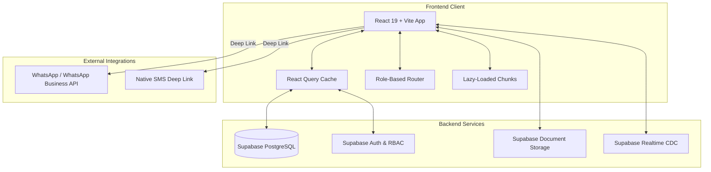

# ⚡ TeleManager - Enterprise Lead & Telemarketing Hub


**TeleManager** is a full-stack, enterprise-grade telemarketing CRM and lead management platform custom-built for high-volume sales teams (e.g. Coshare Loan Consultancy). It streamlines the end-to-end lead lifecycle—from raw Excel ingestion and automated Malaysian IC age-filtering to role-based distribution, real-time team analytics, and one-click WhatsApp/SMS customer outreach.

---

## 🎯 Business Impact (UniPact Bounty #UP-001)

Developed to address critical SME operational bottlenecks for a sales force of 100+ agents:
- ⏱️ **Time Efficiency**: Saves an estimated **14 hours per agent weekly** by automating lead formatting, deduplication, and manual data copy-pasting.
- 💰 **Cost Savings**: Replaces expensive SaaS CRM licenses, saving **~RM 2,500 annually**.
- 🔒 **Data Integrity & Sync**: Eliminates cross-device session collisions and stale data states when agents transition between desktop and mobile devices for customer outreach.
- ⚡ **Lightning Fast Loads**: Code-split modular architecture reduces initial page load bundle sizes by **up to 78%**.

---

## ✨ Core Feature Suite

### 🔐 Multi-Tier Role-Based Access Control (RBAC)
Dedicated views, granular data permissions, and tailored routing for 4 operational tiers:
- 👑 **Super Admin (`super_admin`)**: Global system configuration, user provisioning, role assignments, feedback resolution, and database utility access.
- 🏢 **General Manager (`general_manager`)**: High-level macro analytics, cross-team performance metrics, and organization-wide pipeline health monitoring.
- 📊 **Manager (`manager`)**: Team lead workspace, lead pool allocation, agent lead distribution, backlog management, and performance tracking.
- 🎧 **Staff / Agent (`agent`)**: Personal lead queue, contact status transitions, dynamic promotional script picker, document vault uploads, and 1-click communications.

### 🧩 Modular Architecture & Bundle Optimization
Refactored monolithic dashboards into specialized, directory-scoped component suites with lazy loading (`React.lazy` + `Suspense`):

| Dashboard Suite | Shell Size | Optimization | Component Directory |
|---|---|---|---|
| **Admin Suite** | ~350 lines | **-75%** bundle size | `src/components/admin/` (9 sub-components) |
| **Manager Suite** | ~380 lines | **-78%** bundle size | `src/components/manager/` (6 sub-components) |
| **Staff Suite** | ~240 lines | **-76%** bundle size | `src/components/staff/` (3 sub-components) |
| **Pipeline Suite** | Modular | **-80%** bundle size | `src/components/pipeline/` (11 sub-components) |

### 🇲🇾 Smart Lead Extraction & Malaysian IC Engine
- **Multi-Format Spreadsheet Parsing**: Ingests `.xlsx`, `.xls`, and `.csv` lead files seamlessly using SheetJS (`xlsx`).
- **Malaysian IC & DOB Extractor**: Parses 12-digit IC strings (`YYMMDD-PB-###`) to extract birth years, enabling targeted lead filtering by custom age brackets (e.g. 25–55 years old).
- **Automated Phone Sanitization**: Cleans ambiguous formats into standardized Malaysian `601x` mobile numbers via shared utility engine (`extractionUtils.js`).
- **Database Deduplication**: Automatically detects and prevents duplicate phone entries across team lead pools.

### 💬 One-Click Outreach & Custom Script Engine
- **Dual WhatsApp Routing**: Supports native deep-linking to both **Personal WhatsApp** (`wa.me`) and **WhatsApp Business** (`api.whatsapp.com`).
- **One-Click SMS**: Direct OS integration for rapid SMS dispatch with custom script editing.
- **Dynamic Script Templates**: Built-in promotional script manager with automatic tag substitution (`{Name}`, `{IC}`, `{Phone}`).

### 📱 Responsive Mobile First Layouts
- **Adaptive Mobile Cards**: Responsive card views for mobile screens (<768px) with zero horizontal scrolling or status badge clipping.
- **Desktop Data Tables**: Full-width data tables for desktop and tablet screens with sticky headers.

### 📊 Real-Time Analytics & Team Metrics
- Interactive visual dashboards powered by **Recharts**:
  - Lead status breakdown (Pending, Called, WhatsApp Sent, Accepted, SMS Sent, Rejected, Invalid).
  - Conversion rates, agent activity logs, and backlog volume distributions.
- **Live Supabase CDC**: Real-time Postgres channel synchronization paired with `@tanstack/react-query` cache invalidation.

### 📂 Customer Pipeline & Document Vault
- **Customer Document Management**: Securely attach customer payslips, IC copies, and financial documents via Supabase Storage.
- **Stuck Cases Monitor**: Proactive alert system flagging inactive leads requiring follow-up.

---

## 🏗️ System Architecture



---

## 📁 Detailed Project Structure

```
TeleManager/
├── frontend/                                # Main React 19 + Vite Frontend Workspace
│   ├── backlog/                             # Raw lead backlog & batch processing spreadsheets
│   ├── public/                              # Static assets & favicon icons
│   ├── scripts/                             # Version stamping & backlog utility scripts
│   ├── src/
│   │   ├── components/                      # UI Dashboards & Component Suites
│   │   │   ├── admin/                       # 👑 Super Admin Component Suite
│   │   │   │   ├── AdminActivityHub.jsx     # Drop alerts, manager review & clear actions
│   │   │   │   ├── AdminAgentProfile.jsx    # Detailed agent performance metrics & lead table
│   │   │   │   ├── AdminAssignStaff.jsx     # Pool distribution to agents & clear set
│   │   │   │   ├── AdminCleanAdd.jsx        # Excel parser, IC age filter & database check
│   │   │   │   ├── AdminDirectoryTab.jsx    # User provisioning, GM & Manager assignment
│   │   │   │   ├── AdminFeedbackTab.jsx     # System bug & feedback management panel
│   │   │   │   ├── AdminMaintenanceCards.jsx# Backlog & duplicate lead purge utilities
│   │   │   │   ├── AdminManagerTransfer.jsx # Direct lead transfer between manager pools
│   │   │   │   └── extractionUtils.js       # Pure phone/IC disambiguation & age parser
│   │   │   ├── manager/                     # 📊 Manager Component Suite
│   │   │   │   ├── ManagerActivityHub.jsx   # Team notification cards & drop alerts
│   │   │   │   ├── ManagerAgentProfile.jsx  # Staff member performance & lead list view
│   │   │   │   ├── ManagerCleanAdd.jsx      # Manager lead upload & age filtering card
│   │   │   │   ├── ManagerDirectoryTab.jsx  # Staff account provisioning & contact cards
│   │   │   │   ├── ManagerDistributeTeam.jsx# Team pool distribution & set clear card
│   │   │   │   └── ManagerTeamMatrixTab.jsx # Team performance matrix & Recharts analytics
│   │   │   ├── staff/                       # 🎧 Telemarketing Staff Component Suite
│   │   │   │   ├── StaffLeadDetailView.jsx  # Call dialer, WhatsApp/SMS script & file upload
│   │   │   │   ├── StaffLeadsTab.jsx        # Agent lead queue, stats & mobile card list
│   │   │   │   └── StaffNotificationsTab.jsx# Lead drops, birthday alerts & follow-up reminders
│   │   │   ├── pipeline/                    # 📂 Customer Pipeline Component Suite
│   │   │   │   ├── AddCustomerForm.jsx      # Customer onboarding form & validations
│   │   │   │   ├── AgentDistributionList.jsx# Agent distribution breakdown
│   │   │   │   ├── AllCasesTable.jsx        # All customer cases (Mobile card & Desktop table)
│   │   │   │   ├── AssignToAgentPanel.jsx   # Reassign customer panel
│   │   │   │   ├── CustomerDetailsModal.jsx # Customer record, notes & file vault modal
│   │   │   │   ├── CustomerList.jsx         # Pipeline customer card view
│   │   │   │   ├── CustomerPipelineAdminPage.jsx   # Admin pipeline shell
│   │   │   │   ├── CustomerPipelineManagerPage.jsx # Manager pipeline shell
│   │   │   │   ├── CustomerPipelinePage.jsx # Staff pipeline shell
│   │   │   │   ├── OverviewStats.jsx        # Pipeline stats header cards
│   │   │   │   └── StuckCasesTable.jsx      # Inactive case alert table
│   │   │   ├── AdminDashboard.jsx           # Super Admin master dashboard shell (~350 lines)
│   │   │   ├── GMDashboard.jsx              # General Manager analytics dashboard shell
│   │   │   ├── ManagerDashboard.jsx         # Manager lead allocation dashboard shell (~380 lines)
│   │   │   ├── StaffDashboard.jsx           # Agent workspace dashboard shell (~240 lines)
│   │   │   ├── Login.jsx                    # Multi-role authentication page
│   │   │   ├── NavSlider.jsx                # Animated navigation slider bar
│   │   │   ├── UserDropdown.jsx             # User profile menu & password reset
│   │   │   ├── ConfirmModal.jsx             # Custom modal dialog confirmation
│   │   │   └── LazySpinner.jsx              # Suspense fallback loading spinner
│   │   ├── hooks/                           # Custom React Query data fetching hooks
│   │   │   ├── useAdminData.js              # Query hook for Admin data & CDC channels
│   │   │   ├── useConfirm.js                # Custom confirm dialog hook
│   │   │   ├── useGMData.js                 # Query hook for General Manager data
│   │   │   ├── useManagerData.js            # Query hook for Manager team data
│   │   │   ├── usePipelineData.js           # Query hook for Pipeline customer data
│   │   │   └── useStaffData.js              # Query hook for Staff agent data
│   │   ├── utils.js                         # Malaysian phone & date formatting utilities
│   │   ├── supabase.js                      # Supabase JS SDK client initialization
│   │   └── App.jsx                          # App entry point & role-based routing
│   ├── package.json                         # Dependencies & build scripts
│   └── vite.config.js                       # Vite 6 build configuration
├── scripts/                                 # Root utility & maintenance scripts
├── package.json                             # Root workspace manifest
└── README.md                                # Project documentation
```

---

## 🚀 Getting Started

### Prerequisites
- **Node.js**: v18.0.0 or higher
- **npm**: v9.0.0 or higher
- **Supabase Project**: Active Supabase instance with database tables configured

### Installation

1. Clone the repository:
   ```bash
   git clone https://github.com/DwZukii/Loan-Manager.git
   cd TeleManager/frontend
   ```

2. Install dependencies:
   ```bash
   npm install
   ```

3. Configure Environment Variables:
   Create a `.env` file in the `frontend/` directory:
   ```env
   VITE_SUPABASE_URL=https://your-supabase-project-id.supabase.co
   VITE_SUPABASE_ANON_KEY=your-supabase-anon-key
   ```

4. Run Development Server:
   ```bash
   npm run dev
   ```

5. Open your browser at `http://localhost:5173`.

---

## 🛠️ Tech Stack

- **Frontend**: React 19, Vite 6, JavaScript (ESNext)
- **Styling**: Tailwind CSS 4
- **State & Data Fetching**: `@tanstack/react-query` v5
- **Backend & Database**: Supabase (PostgreSQL, Row Level Security, Storage, Realtime CDC)
- **Data Visualization**: Recharts
- **Icons & UI**: Lucide React, Sonner (Toast notifications)
- **Spreadsheet Ingestion**: SheetJS (`xlsx`)
- **Deployment**: Vercel

---

## 📝 License

This project is licensed under the MIT License.
